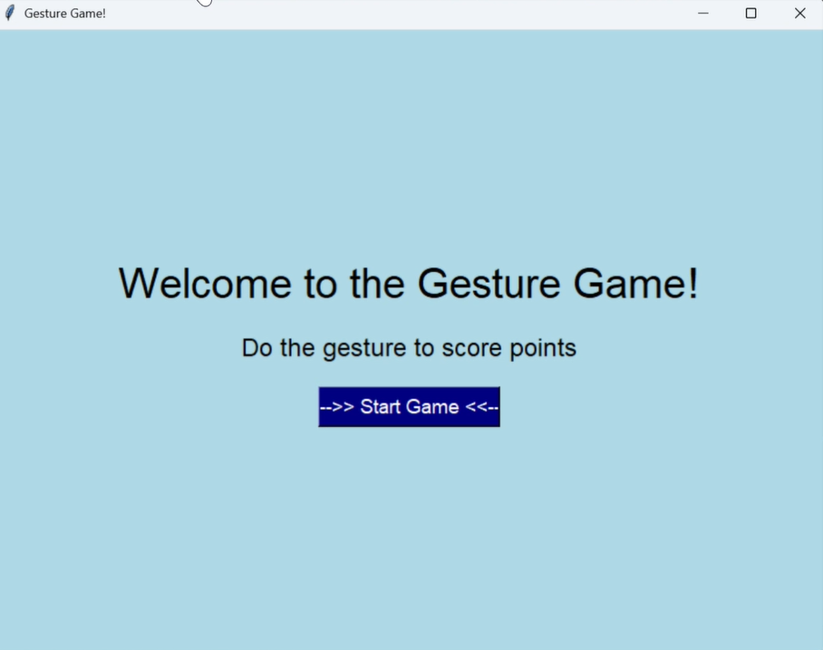
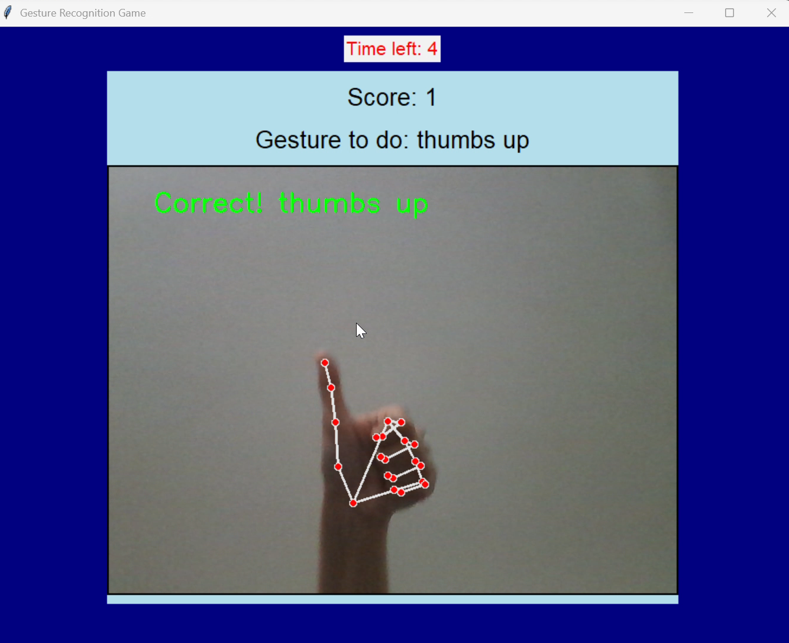

# 🎮 Gesture Recognition Game

A real-time **gesture recognition game** built with **Python, OpenCV, MediaPipe, and Tkinter**.  
Players perform hand gestures like 👍 Thumbs Up, ✌ Peace Sign, 👌 OK Sign, 🤘 Rock and Roll, 🖐 High Five, and 👎 Thumb Down to score points within a limited time.  

This project demonstrates how **computer vision** and **human-computer interaction (HCI)** can be combined to create fun and engaging experiences.

---

## ✨ Features
- 🖐 Real-time gesture recognition using **MediaPipe Hands**.
- 🎥 Webcam-based interaction (no external sensors required).
- 🎨 GUI designed with **Tkinter**.
- ⏱ Countdown timer for each gesture.
- 📊 Score tracking with instant feedback.
- 🚀 Lightweight, runs locally without internet.

---

## 📸 Supported Gestures
- 👍 Thumbs Up  
- ✌ Peace Sign  
- 👌 OK Sign  
- 🤘 Rock and Roll  
- 🖐 High Five  
- 👎 Thumb Down  

---

## 🚀 Installation & Setup

1. **Clone this repository**:
   ```bash
   git clone https://github.com/dana-alduayji/Pose-and-Pass-hand-gesture-detection.git
   cd gesture-game
   ```

2. **Create a virtual environment** (recommended):
   ```bash
   python -m venv venv
   venv\Scripts\activate      # On Windows
   source venv/bin/activate   # On Mac/Linux
   ```

3. **Install dependencies**:
   ```bash
   pip install -r requirements.txt
   ```

   Minimal requirements:
   ```
   opencv-python
   mediapipe
   numpy
   Pillow
   ```

4. **Run the game**:
   ```bash
   python gesture_game.py
   ```

---

## 🕹️ How to Play
1. Start the game and allow webcam access.
2. A gesture prompt will appear (e.g., "Gesture to do: Thumbs Up").
3. Perform the gesture in front of the webcam within **10 seconds**.
4. If detected correctly, your score increases.
5. Continue through the sequence until the game ends. 🎉

---

## 📷 Screenshots

Here are some previews of the game:

### Welcome Screen


### Gesture Detection


👉 To add your own screenshots:  
1. Create a folder in your repo called `screenshots`.  
2. Save your PNG/JPG images inside it.  
3. Update the paths in the README if you rename files.  

---

## 🔧 Tech Stack
- **Python 3.8+**
- [OpenCV](https://opencv.org/) – for video capture & frame processing  
- [MediaPipe](https://developers.google.com/mediapipe) – for hand landmark detection  
- [Tkinter](https://docs.python.org/3/library/tkinter.html) – for the GUI  
- [Pillow](https://pillow.readthedocs.io/en/stable/) – for image handling  

---

## 📖 Future Improvements
- Add more gesture types.
- Enhance accuracy in varied lighting conditions.
- Introduce animations or sound effects for correct gestures.
- Add multiplayer or difficulty levels.

---

## 👩‍💻 Authors
- Shrooq Alqaied  
- Dana AlDuayji  

Prepared under the supervision of **Dr. Muna Almushyti** (CS 432, Artificial Intelligence Project).

---

## 📜 License
This project is licensed under the MIT License – you are free to use, modify, and distribute it.

---

## 📚 References
- Tsai, TH., Huang, CC. & Zhang, KL. *Design of hand gesture recognition system for human-computer interaction.* Multimed Tools Appl 79, 5989–6007 (2020).  
- Cruz, L., Lucio, D. & Velho, L. *Kinect and RGBD Images: Challenges and Applications.* IEEE, 2012.  
- Kohli, P., Shotton, J. *Key Developments in Human Pose Estimation for Kinect.* Springer, 2013.  
- Al-Qurishi, M., Khalid, T. & Souissi, R. *Deep Learning for Sign Language Recognition: Current Techniques, Benchmarks, and Open Issues.* IEEE Access, 2021.  
